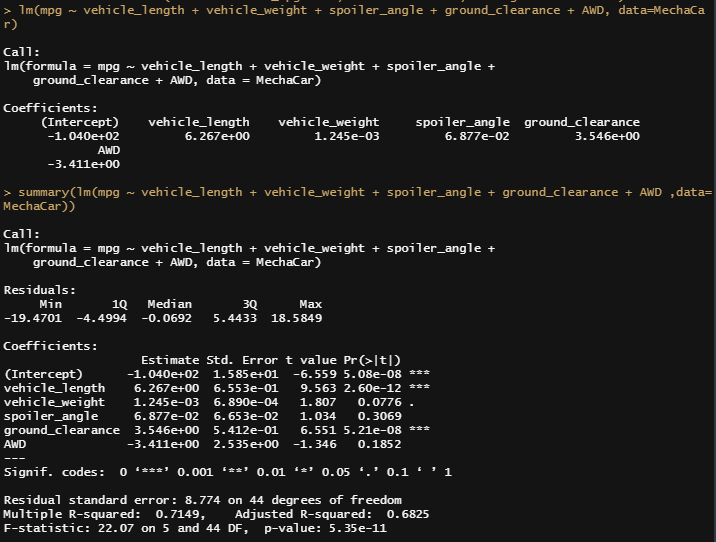
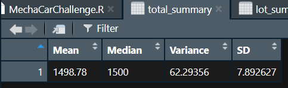
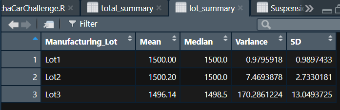
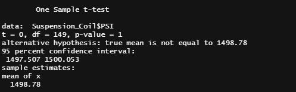
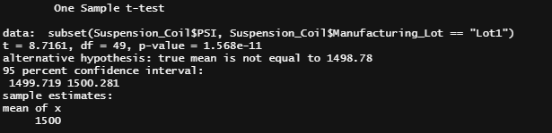
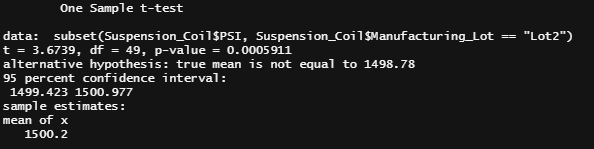
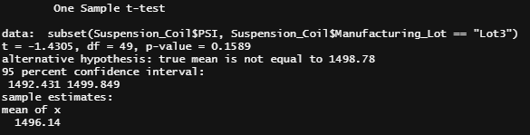

# MechaCar_Statistical_Analysis

## Linear Regression to Predict MPG
The provided dataset has 50 prototypes with 6 variables, mainly the miles per gallon measured across five ohter variables.
An Rscript was used to conduct a linear regression model.
### Results

The above picture shows a summary for the linear regression, the resulting model shows that:\
**MODEL:**\
mpg = -0.104e+02 + **Vehicle_length***6.267 + **Vehicle_weight***1.245e-03 + **Spoiler_angle***6.877e-02 + **Ground_clearance***3.546 + **AWD***-3.411

**SUMMARY:**\
A summary of the linear regression can be displayed to determine the quality of the dataset. In this distribution of the residuals, the dataset fits in with the normal parameters, where the absolute value of the min and max are comparable |-19.47|~|18.58| and the median -.07 is close to zero.

1. Which variables/coefficients provided a non-random amount of variance to the mpg values in the dataset?       
A 95% level of confidence was predetermined, meaning the p-value should be compared to alpha = .05 level of significance to verify if statistically significant. 

Coefficients:      
mpg: 0 < .05, statistically significant, non-random amount of variance     
vehicle length: 0 < .05, statistically significant, non-random amount of variance     
vehicle weight: .08 > .05 not statistically significant, random amount of variance     
spoiler angle: .31 > .05 not statistically significant, random amount of variance    
ground clearance: 0 > .05 statistically significant, non-random amount of variance    
AWD: .19>=.05 not statistically significant, random amount of variance

2. Is the slope of the linear model considered to be zero? Why or why not?    
Converting from scientific notation, all of the slopes of the variables are shown to be non-zero even though some are close to zero:    

Coefficients:    
vehicle length: 6.267    
vehicle weight: .001   
spoiler angle: .069   
ground clearance: 3.546   
AWD: -3.411    

The multiple linear regression formula for mpg = -.01 + 6.267(vehicle length)+.001(vehicle weight)+.069(spoiler angle)+3.546(ground clearance)-3.411(AWD), which results in a non-zero slope.

3. Does this linear model predict mpg of MechaCar prototypes effectively? Why or why not?    
R-squared is .7149, which is a strong correlation for the dataset and shows the dataset is an effective dataset.  However, r-squared is not the only consideration for effectiveness.  There may be other variables not included in the dataset contributing to the variation in the mpg. 

## Summary Statistics on Suspension Coil
### Manufacturing Lot Summary
Below is the summary statistics of all of the manufacturing lots.  The mean is 1498.78 for this sample and the population mean was determined to be 1500.

### Summary by Manufacturing Lot Number
The means of the lot numbers are similar to the population mean and the sample mean.  

1. The design specifications for the MechaCar suspension coils dictate that the variance of the suspension coils must not exceed 100 pounds per square inch. Does the current manufacturing data meet this design specification for all manufacturing lots in total and each lot individually? Why or why not?      
The variance for the total manufacturing lot is 62 < 100, which is within the expected design specifications of staying under 100 PSI.  However, when reviewing the data by Lot number, Lot 3 is a large contributing factor to the variance being high.  Lot 3 shows a variance of 170 > 100 and does not meet the design specifications.  Lot 1 and Lot 2 have significantly lower variance, 1 and 7 respectively.  

## T-Tests on Suspension Coils
### T-test for all Lots
All Manufacturing Lots: p-value = .6028, alpha = .05   
.60 > .05, which means the total manufacturing lot is not statistically significant from the normal distribution and normality can be assumed.  The mean falls within the 95% confidence interval.

### T-test for Lot 1
Lot 1: p-value = 1, alpha = .05    
1 > .05, which means Lot 1 is not statistically significant from the normal distribution and normality can be assumed.  The mean falls within the 95% confidence interval.

### T-test for Lot 2
Lot 2: p-value = .6072, alpha = .05 

.60 > .05, which means Lot 2 is not statistically significant from the normal distribution and normality can be assumed.  The mean falls within the 95% confidence interval.

### T-test for Lot 3
Lot 3: p-value = .04168, alpha = .05   
.04 < .05, which means it is statistically significant from the normal distribution and normality cannot be assumed.  However, the mean falls within the 95% confidence interval.

The overall manufacturing, Lot 1, and Lot 2 show a normal distribution.  Therefore, there is not sufficient evidence to reject the null hypothesis, which shows the two means are statistically similar. 

## Study Design: MechaCar vs Competition
When comparing MechaCar to its competitor’s other metrics that could be of interest to a consumer could include cost, car color, city fuel efficiency, highway fuel efficiency, horsepower, maintenance cost, or safety rating.

1. What metric or metrics are you going to test?   
The next metrics to test should be the safety rating, horsepower, and highway fuel efficiency, which address some safety concerns of consumers. 

2. What is the null hypothesis or alternative hypothesis?    
The null hypothesis is that the mean of the safety rating is zero. The alternative hypothesis is that the mean of the safety rating is not zero.

3. What statistical test would you use to test the hypothesis? And why?     
Using a multiple linear regression statistical summary would show how the variables impact the safety ratings for MechaCar and their competitors.

4. What data is needed to run the statistical test?     
A random sample of n > 30 for MechaCar and their competitor, would need to be collected including the safety ratings, highway fuel efficiency, and horsepower plus running the data through RStudio.
